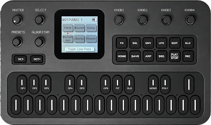

# M-VAVE FM1 Editor & Librarian

A browser-based voice editor and patch librarian for the [M-VAVE FM1](https://www.mvave.com/).

The app runs entirely in the browser. Build and organise up to 10 local patch banks, edit every standard DX7 voice parameter and the FM1 effects chain, audition sounds on the FM1, and transfer individual voices or complete banks over MIDI SysEx. Four classic Yamaha DX7 factory banks are loaded initially. New workspace banks can use any of 35 bundled catalog banks or a standard 32-voice DX7 `.syx` upload.



## Features

- Start with Yamaha DX7 ROM 1A, ROM 1B, ROM 2A, and ROM 2B in browser banks A–D
- Add up to six named workspace banks from the bundled DX7 bank catalog or your own SysEx file, so every bank starts populated
- Give each workspace bank a title and description, shown when hovering over its tab
- Restore the four factory banks at any time
- Restore imported and edited banks automatically from IndexedDB browser storage
- Import standard Yamaha DX7 32-voice bulk SysEx banks
- Search and reorder patches with pointer or keyboard drag-and-drop
- Export one browser bank as `.syx` or all loaded banks as a `.zip`
- Edit all standard DX7 voice parameters with live MIDI updates
- Visualise all 32 DX7 algorithms, including carrier and modulator roles
- Edit four-stage envelopes graphically or with precise numeric controls
- Edit the FM1's filter, reverb, delay, distortion, chorus, and phaser
- Apply six sound-shaping presets as undoable starting points
- Randomise a sound as an undoable starting point
- Mute or solo operators temporarily while designing a sound
- Open contextual help for voice, envelope, algorithm, and effect controls
- Rename patches using DX7-compatible 10-character names
- Undo and redo edits within the voice editor
- Save edits to the browser library, resend them, or revert both the editor and FM1 to the last saved version
- Warn before leaving an unsaved editing session, with save, discard, and keep-editing choices
- Send individual sounds to the edit buffer or a complete 32-patch bank over Web MIDI
- Select matching FM1 slots with MIDI Program Change and track whether a bank is local, transferred, or changed since transfer
- Select MIDI input and output ports, with separate channels for notes/program changes and FM1 effects
- Monitor incoming and outgoing MIDI messages, inspect SysEx data, and copy it as hexadecimal
- Play notes on the FM1 from an on-screen keyboard
- Use the interface in English, French, Spanish, German, Brazilian Portuguese, or Simplified Chinese
- Match the interface accent and product image to any of the six FM1 colour finishes

## Requirements

- An M-VAVE FM1
- A MIDI connection between the computer and FM1
- A Chromium-based browser with Web MIDI and SysEx support, such as Chrome, Edge, or Opera

A standard 4,104-byte Yamaha DX7 32-voice bulk bank (`.syx`) is optional if you want to import additional sounds.

Web MIDI requires a secure context. The local development server uses HTTPS by default.

## Using the editor & librarian

1. Open the app in a supported browser.
2. Switch **MIDI online** on and grant MIDI/SysEx permission.
3. Open **Settings** to select the FM1 MIDI output and, if needed, the note/program and effects channels.
4. Select DX7 Bank 1, 2, 3, or 4. On first use these contain DX7 factory ROM 1A, ROM 1B, ROM 2A, and ROM 2B respectively. Use **Add new bank** to name an additional workspace bank, then populate it from the bundled [Yamaha Black Boxes DX7 catalog](https://yamahablackboxes.com/collection/yamaha-dx7-synthesizer/patches/) or your own standard 32-voice DX7 SysEx file.
5. Click a patch to select the matching FM1 slot, load it into the edit buffer, and open the voice editor. Changes are sent live once the initial voice and effects have reached the FM1.
6. Use **Save to Library** to keep an edit, or open its adjacent menu to resend the working copy or **Revert to Saved** on both the editor and FM1.
7. Return to the librarian and choose **Send to FM1** to transfer the selected browser bank.
8. When the FM1 displays its bank selection screen, turn knob 1, 2, 3, or 4 to choose destination bank A, B, C, or D. The hardware saves the bank automatically after a short delay.

After the first successful connection, the app remembers the selected MIDI ports and both channels and reconnects automatically on future visits. Switch **MIDI online** off to disable automatic connection.

The selected bank in the browser does not determine the hardware destination—the final destination is chosen on the FM1 itself.

To import another bank, open that workspace bank's menu, choose **Import DX7 bank**, and select a compatible `.syx` file. The same bank menu lets you download that bank. Use the menu in the patch-bank header to download all loaded banks or restore the four factory banks. If a bank is empty, you can load the built-in demo bank instead.

The interface follows the browser language on first use when it is supported. Change it later in **Settings**; the selection is remembered. Settings also provides separate channels for notes/program changes and effects because the FM1 defaults its effects controls to MIDI channel 2.

> [!IMPORTANT]
> Imported voices, edits, and FM1 effect settings are saved in this browser and restored after a page reload. Download important banks as `.syx` files as an additional backup, especially before clearing browser data. DX7 `.syx` export contains voice data only; the FM1-specific effect settings remain in the browser library.

Workspace-bank titles, descriptions, imported sounds, voice ordering, saved editor changes, and FM1 effect settings are saved automatically in the browser.

## Anonymous usage analytics

The deployed site uses cookie-free [Umami](https://umami.is/) analytics to understand aggregate
feature usage and connection failures. Tracking is restricted to the production domain, respects
the browser's Do Not Track preference, and excludes URL query strings and fragments. Events contain
only fixed feature names and coarse diagnostic categories. Patch and bank names, uploaded filenames,
MIDI port identities, SysEx data, browser error messages, and persistent user identifiers are never
sent. The interface links to [Umami's privacy policy](https://umami.is/privacy).

## Deployment security

Cloudflare Pages applies the Content Security Policy in `public/_headers` to every route. The policy
keeps scripts, styles, fonts, images, frames, workers, and network requests self-hosted except for the
Umami tracker and its event endpoint. Run `npm run build` followed by `npm run security:check` after
changing the policy or introducing a new browser resource origin.

## Local development

Use Node.js 24.18.0 and npm 11.16.0, as pinned by `.node-version` and
`package.json`, then run:

```bash
npm install
npm run setup:https
npm run dev
```

After adding, removing, or updating a dependency, refresh and validate the
lockfile with the same npm release used by Cloudflare:

```bash
npm run lockfile:refresh
npm run check:install
```

The second command catches incomplete platform-specific optional dependency
entries before they reach a pull request build.

The one-time HTTPS setup uses [`mkcert`](https://github.com/FiloSottile/mkcert) to create and trust a local certificate. On macOS, install it first with `brew install mkcert`. Open the HTTPS URL printed by Vite.

To use HTTP instead, run `npm run dev:http`.

## Quality checks

Before opening a pull request, run the deterministic local quality suite:

```bash
npm run check
```

This checks formatting, TypeScript/React and CSS linting, compiler types, unused
dependencies/files/exports, unit and rendered accessibility tests, reproducible responsive image
assets, the production build, deployed security headers, public source maps, and the initial
JavaScript budget. It does not contact the npm registry. GitHub Actions runs the same layers on
pushes to `main` and on pull requests.

Use `npm run format` for deterministic formatting and Tailwind class ordering. Use
`npm run lint:fix` for ordinary Oxlint and Stylelint autofixes. Review both diffs before committing,
especially conditional class strings passed to `cn(...)`. Do not use Oxlint's
`--fix-dangerously` option or `npm audit fix --force`.

Accessibility is checked in three complementary ways:

- Oxlint's JSX accessibility rules catch static roles, properties, names, labels, and keyboard
  patterns.
- `npm run test:a11y` runs Axe against representative rendered interactive states. The normal
  `npm test` command includes these tests.
- Lighthouse and manual browser testing cover layout-dependent behaviour such as colour contrast,
  focus visibility, and responsive interaction that jsdom cannot evaluate reliably.

The audit commands below require npm registry access. A registry failure is a failed audit, not a
clean result. Both commands block on high or critical advisories.

## Available scripts

| Command                     | Description                                                         |
| --------------------------- | ------------------------------------------------------------------- |
| `npm run check`             | Run all deterministic checks expected before a pull request         |
| `npm run format:check`      | Verify Prettier formatting and Tailwind class ordering              |
| `npm run format`            | Apply Prettier formatting and Tailwind class ordering               |
| `npm run images:generate`   | Regenerate committed responsive WebP candidates with Sharp          |
| `npm run images:check`      | Verify responsive candidates are current, sized, and reproducible   |
| `npm run images:check:dist` | Verify hashed responsive candidates in the production output        |
| `npm run lint`              | Run Oxlint and Stylelint; warnings fail the command                 |
| `npm run lint:code`         | Run type-aware TypeScript, React, import, promise, and test linting |
| `npm run lint:css`          | Check CSS with Stylelint                                            |
| `npm run lint:fix`          | Apply ordinary safe Oxlint and Stylelint fixes                      |
| `npm run lint:css:fix`      | Apply Stylelint fixes only                                          |
| `npm run security:check`    | Verify the built Cloudflare Pages Content Security Policy           |
| `npm run typecheck`         | Check TypeScript with `tsc` without emitting files                  |
| `npm run deps:check`        | Find unused dependencies, source files, and exports with Knip       |
| `npm run deps:audit:prod`   | Audit production dependencies (requires registry access)            |
| `npm run deps:audit`        | Audit the full dependency tree (requires registry access)           |
| `npm test`                  | Run all unit and rendered accessibility tests                       |
| `npm run test:a11y`         | Run the focused rendered Axe accessibility suite                    |
| `npm run build`             | Create a production Vite build in `dist/`                           |
| `npm run bundle:check`      | Enforce the transitive initial JavaScript gzip budget               |
| `npm run check:install`     | Validate a clean install (requires registry access)                 |
| `npm run lockfile:refresh`  | Refresh the lockfile (requires registry access)                     |
| `npm run setup:https`       | Create and trust the local HTTPS certificate                        |
| `npm run sourcemaps:check`  | Validate every emitted JavaScript chunk and production source map   |
| `npm run dev`               | Start Vite on `127.0.0.1` with HTTPS                                |
| `npm run dev:http`          | Start the Vite development server with HTTP                         |
| `npm run dev:https`         | Start Vite on `127.0.0.1` with HTTPS                                |
| `npm run preview`           | Preview the production build locally                                |
| `npm run preview:https`     | Preview the production build locally over HTTPS                     |

### Responsive image assets

The full-size WebPs in `src/assets/` are the source images and the largest browser fallbacks.
Smaller candidates in `src/assets/generated/` are committed build inputs so a normal Vite build
does not depend on platform-specific manual tooling. After changing a source image, run
`npm run images:generate` with the pinned Node/npm toolchain and commit the regenerated candidates.
`npm run images:check` checks the source and candidate dimensions and aspect ratios, verifies each
candidate is a readable WebP, and rejects candidates larger than their source. It intentionally does
not byte-compare newly encoded images because native WebP output can vary by platform. The
post-build check also requires a hashed production asset for every candidate. Do not edit files in
`src/assets/generated/` manually.

### Production source maps

The standard `npm run build` produces public external source maps for every first-party JavaScript
chunk, including lazy chunks. This is intentional: the project is open source, has no private
source-map upload service, and public maps make production debugging and Lighthouse analysis useful.
Maps retain `sourcesContent` for reliable debugging. Browsers do not ordinarily request external
maps during page loading; developer tools fetch them when needed.

`npm run sourcemaps:check` verifies that each JavaScript chunk advertises exactly one matching map,
that every map is valid and non-orphaned, and that maps contain no inline data, private filesystem
paths, environment files, or development certificate material. `dist/`, source maps, and one-off
Lighthouse reports are generated deployment artifacts and must not be committed.

The deliberate alternatives are `SOURCE_MAPS=none npm run build` and
`SOURCE_MAPS=hidden npm run build`; unknown values fail the build. Hidden maps should only become the
deployment default after a real monitoring service, upload step, hash matching, access policy, and
retention policy exist. Run the source-map check with the same `SOURCE_MAPS` value used for the build.

### Lighthouse

Run Lighthouse against a production build rather than the Vite development server:

```bash
npm run build
npm run preview:https
```

Then audit the HTTPS URL printed by Vite in a private browser window. The development
server includes React diagnostics, hot reloading, source modules, and unminified
dependencies, so its performance score does not represent a deployed build.

## Tech stack

- React 19 and TypeScript
- Vite
- Tailwind CSS
- WebMidi.js
- dnd-kit
- i18next and react-i18next
- fflate
- Lucide icons

## SysEx compatibility

The DX7 import feature intentionally validates bank files before loading them. A compatible file must:

- contain exactly 32 packed DX7 voices
- be exactly 4,104 bytes long
- use the Yamaha DX7 32-voice bulk dump header and terminator
- contain a valid Yamaha checksum

Single-voice dumps, larger archive files, and banks using another SysEx format are not accepted.

The browser library is the source of truth. The current FM1 firmware does not document transmission of stored voices or banks over MIDI, so the librarian cannot import a bank directly from the hardware. Keep `.syx` source files or download browser banks as backups. If M-VAVE adds bulk-dump output in a future firmware release, device-to-browser bank import can be added without changing the saved library format.

## Future development

Future development could add grouped modulation workflows and device readback if M-VAVE documents a compatible transmit protocol.

## Project structure

```text
src/
├── components/       UI, MIDI controls, and patch-bank components
├── data/             Patch metadata and bundled DX7 factory banks
├── hooks/            Patch-library, MIDI, and FM1 colourway state
├── i18n/             Localisation setup and translated interface/help text
├── lib/              DX7 SysEx parsing, MIDI transfer, and utilities
└── routes/           Application layout, librarian, and voice editor pages
```

## Acknowledgements

The interface links to independent DX7 patch archives to help users find compatible banks. Those downloads are provided by their respective sites; only import files you trust.
