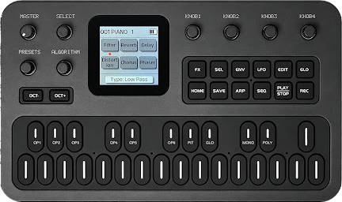

# M-VAVE FM1 Editor & Librarian

A browser-based voice editor and patch librarian for the [M-VAVE FM1](https://www.mvave.com/).

The app runs entirely in the browser. Build and organise up to 10 local patch banks, edit every standard DX7 voice parameter and the FM1 effects chain, and transfer individual voices or complete banks over MIDI SysEx. The FM-1's own four factory banks are loaded initially. New banks can use any of 65 bundled catalog banks or a standard 32-voice DX7 `.syx` upload.

## Features

- Start with the FM-1's four factory banks in banks A–D, so slot names match the patches on a stock FM1
- Add up to six additional banks from the bundled DX7 bank catalog or your own SysEx file, so every bank starts populated
- Rename, describe, or delete banks, with descriptions available from their tabs
- Replace a populated bank only after confirming that its current patches will be overwritten
- Reset banks A–D to the four factory banks at any time without removing additional banks
- Download a backup of every bank, FM1 effect setting, and saved bank in one file, and restore it later
- Save named copies of a bank in the browser, then load, rename, copy, download, or delete them later
- Copy a patch and its FM1 effects over any slot in a bank that has patches, from its **⋮** menu or
  by dragging it onto a bank
- Undo deleting a bank, resetting to the factory patches, restoring a backup, importing over or loading into a bank, or copying a patch over a slot, from its notification or with Cmd/Ctrl + Z
- Keep imported and edited banks across page reloads in IndexedDB browser storage
- Retry browser-storage failures or continue explicitly with a session-only library without overwriting unreadable saved data
- Import standard Yamaha DX7 32-voice bulk SysEx banks
- Download a single patch as a DX7 `.syx` file, or import one over a slot, from the slot's **⋮** menu (**Download patch** and **Import patch…**)
- Search every bank at once, and reorder patches with pointer or keyboard drag-and-drop
- Find duplicate patches: the patches in your banks whose voice settings match, renamed copies included, with a way to go to each one
- Search your saved banks and the 65 bundled DX7 catalog banks at the same time, play any match through the FM1 edit buffer, and copy it into a slot of your own, or double-click it to copy it and open it in the editor
- Export one bank as `.syx`, or every loaded bank as a `.zip` of SysEx files for Dexed, a DX7, or other DX7 tools (DX7 data only, without FM1 effects)
- Edit all standard DX7 voice parameters with live MIDI updates
- Compare the six operators as table rows under shared column headings on a wide window, and open any one in place beneath its row with its full controls; narrower windows show them as a rack of columns
- Type an operator's ratio, or its fixed frequency in hertz, and Coarse and Fine move to the nearest setting the FM1 can play
- Mute or solo any operator straight from its rack column, without opening it first
- Copy an operator's settings, or only its envelope, and paste them onto another operator, in the same patch or a different one
- Fold the operators and effects panels away to focus the editor on the sections in use
- Visualise all 32 DX7 algorithms, including carrier and modulator roles and each operator's frequency
- Edit four-stage amplitude and pitch envelopes graphically or with precise numeric controls
- Start the pitch envelope from Flat, Attack blip up, Attack drop, Scoop, or Release fall shapes as a single undo step
- Watch the LFO on a scrolling scope that follows the selected wave and LFO Speed
- Edit the FM1's filter, reverb, delay, distortion, chorus, and phaser within their documented ranges
- Start any FM1 effect from a preset in its box, such as Small room, Slapback, Chorus wash, or Warm drive, as a single undo step
- See a live animated scope for every FM1 effect, drawn from its parameters: filter response, delay taps, chorus drift, reverb tail, distortion clipping, and phaser sweep
- Start from the Presets menu: Yamaha's DX7 INIT VOICE, a musically constrained random DX7 voice, or six sound-shaping presets, each as a single undo step
- Open contextual help for voice, envelope, algorithm, and effect controls
- Rename patches using DX7-compatible 10-character names
- Undo and redo edits within the voice editor
- Compare edits with the saved sound, switching the FM1 between the two while editing pauses, without losing the edits or their undo history
- Save edits to the browser library, resend them, or revert both the editor and FM1 to the last saved version
- Warn before leaving an unsaved editing session, with save, discard, and keep-editing choices
- Undo, redo, save, and leave the voice editor from the keyboard
- Jump to patch search, clear it, and open the lit slot from the keyboard
- Heart patches from any bank or search result into Favourites, reorder and edit them, and send them to the FM1 as a bank
- Send individual patches to the edit buffer or a complete 32-patch bank over Web MIDI in Chrome, Edge, Opera, or Firefox
- Audition any patch with a click: a slot in banks A–D selects the matching FM1 slot with MIDI Program Change, then sends the library's voice to the edit buffer, and a patch from an added bank goes straight to the edit buffer
- Select MIDI input and output ports, with separate channels for notes/program changes and FM1 effects
- Recognise Baud Girl's FM-1+VA replacement firmware, and send it patches as parameter changes so auditions never overwrite a stored preset
- Import the FM1's banks A–D with their effects, read straight from an FM1 on Baud Girl's firmware or from the file its **Save a backup** writes, into the library banks you choose or new ones, with a preview that marks the patches differing from the library, and Undo
- Write library patches back to an FM1 on Baud Girl's firmware, preset by preset with their effects, only where they differ, each read back to confirm it
- Monitor incoming and outgoing MIDI messages, inspect SysEx data, and copy it as hexadecimal
- Play notes on the FM1 from an on-screen keyboard, or loop one of six short phrases to audition a patch hands-free
- Release hanging notes on the FM1 with a MIDI panic button
- Use the interface in British or American English, French, Spanish, German, Brazilian Portuguese, or Simplified Chinese
- Use a dark CRT-terminal interface whose accent, product image, and tab icon follow any of the six FM1 colour finishes, with contrast checked to WCAG 2.2 AA in each
- Install the editor as a standalone desktop app in browsers that support installation

## Requirements

- An M-VAVE FM1
- A MIDI connection between the device and FM1
- A browser that supports Web MIDI and SysEx:

  | Browser | Drives the FM1 | Where                             |
  | ------- | -------------- | --------------------------------- |
  | Chrome  | Yes            | Desktop and Android               |
  | Edge    | Yes            | Desktop                           |
  | Firefox | Yes            | Desktop                           |
  | Safari  | No             | Nor any browser on iPhone or iPad |

A standard 4,104-byte Yamaha DX7 32-voice bulk bank (`.syx`) is optional if you want to import additional patches.

Web MIDI requires a secure context. The local development server uses HTTPS by default.

## Using the editor & librarian

1. Open the app in a supported browser.
2. Switch **MIDI online** on and grant MIDI/SysEx permission. Firefox asks you to install a small site permission add-on instead; accept it.
3. Open **Settings** to select the FM1 as the MIDI output and the input monitor and, if needed, the note/program and effects channels. With the input selected, the app asks the FM1 which firmware it runs and shows the answer under **FM1 firmware**.
4. Select Bank 1, 2, 3, or 4. On first use these contain FM-1 Banks 1, 2, 3, and 4, the patches the FM1 ships with. Use **Add new bank…** to name and describe an additional bank while populating it from the bundled DX7 catalog, which holds banks from the [Yamaha Black Boxes collection](https://yamahablackboxes.com/collection/yamaha-dx7-synthesizer/patches/) and mene311's themed FM-1 banks, or your own standard 32-voice DX7 SysEx file.
5. Click a patch to select the matching FM1 slot and play it: the voice and effects in your library go to the edit buffer, so you hear the patch as it is in the browser even before its bank is on the FM1. The FM1 has four banks, so a patch in an added bank is only sent to the edit buffer. Double-click it, or choose **Edit** from its **⋮** menu, to load it into the edit buffer and open the voice editor. Changes are sent live once the initial voice and effects have reached the FM1. On the [FM-1+VA](https://baudgirl.com/work/FM-1+VA) replacement firmware, which stores a single-patch transfer over the selected preset, and whenever the firmware is not identified, a patch is sent as parameter changes instead, so it stays an unsaved edit until you press **SAVE** on the FM1.
6. Use **Save to library** to keep an edit, or open its adjacent menu to resend the working copy or **Revert to saved** on both the editor and FM1.
7. Select the heart on any patch, or search result, to keep it in **Favourites**, below the banks on the left. Favourites can be played, edited, and reordered like a bank, and editing a favourite or the patch it came from updates both.
8. Return to the librarian and choose **Send to FM1** to transfer the selected bank, or Favourites. Favourites is sent as a 32-patch bank: a shorter list is filled with INIT VOICE, and from a longer one only the first 32 are sent. The instructions before sending say which.
9. When the FM1 displays its bank selection screen, turn knob 1, 2, 3, or 4 to choose destination bank A, B, C, or D. The hardware saves the bank automatically after a short delay. FM-1+VA before FM-1_079 asks **Replace Bank A?** instead, starting on bank A: turn **ALGORITHM** to the destination bank, then turn **SELECT** to **Replace** and press **SEL**. It also replaces that bank's factory presets for good. The instructions before sending follow the firmware the FM1 named. From FM-1_079, FM-1+VA needs no steps on the FM1: you choose its bank A–D in the app, which writes only the patches that differ, with their effects, and a short Favourites leaves the rest of the bank as it is.

See the [user guide](docs/user-guide.md) for bank management, Favourites, the voice editor,
keyboard shortcuts, and SysEx compatibility.

### Your data

> [!IMPORTANT]
> Imported voices, edits, and FM1 effect settings are saved in this browser and kept after a page reload. Use **Download backup**, under **Backup** in the patch-bank header's **Library actions** (⋮) menu, to keep a copy, especially before clearing browser data: the backup file holds the banks, their FM1 effects and FM-1+VA preset settings, Favourites, and saved banks, and only this app can restore it. DX7 `.syx` export contains voice data only, for use in other DX7 tools.

Bank titles, descriptions, imported patches, patch ordering, Favourites, saved editor changes, and FM1 effect settings are saved automatically in the browser.

If the saved library cannot be opened, the app leaves its browser record untouched and offers **Retry** or **Continue without saving**. The latter creates an explicit session-only library whose changes are lost when the page closes. If a later save fails, the latest changes remain available in memory and can be saved again with **Retry saving**.

## Translations

The librarian is available in multiple languages. If you notice an inaccurate, unclear, or unusual translation, please [get in touch by opening an issue](https://github.com/benny-sparra/fm1-dx7-patch-importer/issues) so it can be corrected.

## Privacy

The deployed site uses cookie-free, aggregate usage analytics and error monitoring. Patch and bank
names, uploaded filenames, MIDI port identities, and SysEx data are never sent. See
[PRIVACY.md](PRIVACY.md) for details.

## Documentation

- [User guide](docs/user-guide.md): using the librarian and voice editor, keyboard shortcuts, and
  SysEx compatibility
- [Switching FM1 firmware](docs/switching-firmware.md): moving an FM1 between M-VAVE's firmware,
  FM-1+VA, Felucca, and SLOOP, and recovering from a failed install
- [Accessibility](ACCESSIBILITY.md): what the app supports, known barriers, and how to report one
- [Privacy](PRIVACY.md): anonymous usage analytics and error monitoring
- [Contributing](CONTRIBUTING.md): local development, quality checks, scripts, and project structure
- [Maintaining](docs/maintaining.md): deployment security, generated assets, source maps, and
  Lighthouse
- [FM1 research notes](docs/fm1-research.md): the evidence behind FM1-specific MIDI behaviour

## FM1 protocol research

The repository records the evidence behind FM1-specific behaviour in
[the FM1 research notes](docs/fm1-research.md). The live effect controls use the documented
24-controller FM1 effects block, with their supported ranges enforced by the editor. The internal
sequencer is being researched through captured fixtures only; it is not yet exposed in the app and
the editor does not send sequencer or other unclassified vendor commands. The one updater message it
sends is the read-only identity query, to tell M-VAVE's firmware from FM-1+VA; the notes record how
the editor was tested on FM-1+VA and why it sends that firmware patches as parameter changes. Of
FM-1+VA's own commands it sends only the read of a stored preset, which changes nothing, and the
write of one, which **Write patches to the FM1…** sends after naming every preset it replaces,
reading each back to confirm it.

## Future development

Future development could add grouped modulation workflows, a focused internal-sequencer editor once
its protocol is proven safe, and device readback if M-VAVE documents a compatible transmit protocol.
FM-1+VA also offers direct sequencer pattern transfer through a command of its own, which could
support editing its Sequencer, and its preset write could carry back the Virtual Analog presets the
library now keeps, each once reviewed and approved.

## Acknowledgements

The randomiser is an independent implementation of the voice generator from Tom Bajoras's DX Android, following [the algorithm documented by Christian Zietz (czietz) at CHZ-Soft](https://www.chzsoft.de/site/hardware/dx-android-an-intelligent-random-dx7-voice-generator/dx-android-algorithm/).

The four FM-1 factory banks, loaded into banks A–D on first use and also offered in the catalog, were recovered from M-VAVE's preset-restore tool by KingParamount and are bundled unchanged under CC0 from [fm1-factory-presets](https://github.com/KingParamount/fm1-factory-presets). The licence covers the capture, decode and rebuilt files, not the voices themselves: those trace to Yamaha ROM and VRC cartridges and the community Dexed_cart 1.0 collection, as selected and renamed by M-VAVE. The repository documents the per-voice provenance.

The 26 themed banks in the catalog's **mene311** group are bundled unchanged, with mene311's permission, from [fm1-banks](https://github.com/mene311/fm1-banks). mene311 sorted voices from public DX7 collections, among them Dexed cartridge dumps, Yamaha Black Boxes, and Bobby Blues, into banks of 32 by theme. The voices remain the work of their original programmers, and the repository's `banks/provenance.json` records the collections each one came from.

[FM-1+VA](https://baudgirl.com/work/FM-1+VA) is Madeline Hoyle's (Baud Girl) replacement firmware for the FM1. Its manual and published web modules informed the research notes; no code was copied from it.

The interface links to independent DX7 patch archives to help users find compatible banks. Those downloads are provided by their respective sites; only import files you trust.

If you have programmed a DX7 bank of your own, or gathered other people's voices into banks, you can offer it for the bundled catalog: see [Contributing a patch bank](CONTRIBUTING.md#contributing-a-patch-bank).

## Licence

The editor's source code, documentation, and artwork are released under the [MIT License](LICENSE).
This does not cover third-party material bundled with it, which keeps its own terms:

- **FM1 product images and the M-VAVE logo**: `src/assets/fm1-*.webp`, `src/assets/fm1-header.png`,
  `src/assets/m-vave-logo.png`, `src/assets/m-vave-logo.svg`, their resized copies in
  `src/assets/generated/`, and `public/fm1-preview.png`. These are not the project's own; they stay
  with their owners and are used only to show which device the editor is for. The M-VAVE name and
  logo belong to M-VAVE, and this project is independent: it is not affiliated with or endorsed by
  M-VAVE.
- **Patch banks**: the files in `public/dx7-banks/` keep the terms described under
  [Acknowledgements](#acknowledgements), and banks contributed to the catalog keep the licence their
  author chose.
- **Fonts**: Doto, Space Grotesk, IBM Plex Mono, and VT323 are installed from npm under the SIL Open
  Font License 1.1.
