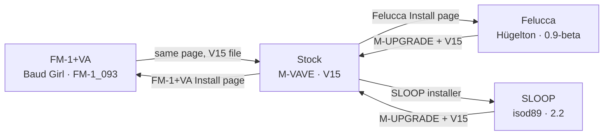

# Switching FM1 firmware

How to move one FM1 between M-VAVE's stock firmware, Baud Girl's
[FM-1+VA](https://baudgirl.com/work/FM-1+VA), Hügelton Instruments'
[Felucca](https://hugelton.github.io/Felucca/), and isod89's
[SLOOP](https://github.com/isod89/sloop-fm1), a groovebox firmware built on Felucca. Use the stock
firmware as the middle point: go back to it before moving from one replacement firmware to another.
Written for M-VAVE V15, FM-1+VA `FM-1_093`, and Felucca 0.9-beta, from each project's own pages as
they stood on 3 October 2026, and SLOOP 2.2, as it stood on 5 October 2026.

This app never installs firmware. Every step below uses the firmware projects' own tools.

No direct route between FM-1+VA and Felucca or SLOOP is documented. Felucca and SLOOP share an
installer, so moving straight between them may work, but neither project documents it (see
[Between Felucca and SLOOP](#between-felucca-and-sloop)).

## Before any switch

The FM1 cannot send its presets back to this app, so your library is your only copy of its patches.

- In this app, choose **Download backup** from the menu in the patch-bank header.
- Leaving FM-1+VA: in its Device Manager, press **Back up everything**. It saves all 128 presets as
  one `.syx` file and the 16 patterns as another. Only FM-1+VA can restore them, with **Install a
  backup** in the Device Manager; this app's **Import Baud Girl presets file…** reads only the
  presets file's patches.
- Leaving SLOOP: in its [web editor](https://isod89.github.io/sloop-fm1/webapp/editor/), open
  **Library** and use **Export bank** under **User presets on the device**, and **Export library**
  for the sounds kept in the editor. No export of SLOOP's projects (its patterns and songs) is
  documented.
- Have M-VAVE's files ready from [m-vave.com/download](https://www.m-vave.com/download):
  **M-UPGRADE** (PC Software, Windows or Mac) and **FM-1 V15** (PC Firmware). Leaving Felucca or
  SLOOP depends on them.
- Plug the USB cable straight into the computer, not a hub.
- Close every other app using the FM1. In this app, switch MIDI off.

## Stock to FM-1+VA

The install takes under a minute, and your saved presets and patterns are kept.

1. Open FM-1+VA's **Install** page in Chrome or Edge, and allow MIDI access.
2. Click **Check your FM-1**, then complete the checklist.
3. Click **Install** and keep the FM1 connected. The display goes dark while it installs; that is
   normal.

The installer will not reinstall the release the FM1 already runs. The startup screen shows the
version, such as VERSION 93 for `FM-1_093`.

## FM-1+VA to stock

FM-1+VA's own installer puts M-VAVE's firmware back; M-UPGRADE is not needed for this direction.

1. In FM-1+VA's Device Manager, press **Back up everything**.
2. On its Install page, choose **Install a file from your computer** and pick M-VAVE's V15
   `FM-1.fwsc`.
3. Follow the usual install steps.

Virtual Analog and 8-Bit presets do not play on stock firmware, and FM-1+VA's extra FM features go away.

## Stock to Felucca

Felucca's page installs its own prebuilt package and does not ask for M-VAVE's file.

1. Open the [Felucca installer](https://hugelton.github.io/Felucca/webapp/installer/) in Chrome or
   Edge and click **Install**.
2. It runs through Starting, Verifying, Switching to update mode, Writing, Restarting, and Done.
   Do not unplug the cable while it writes.
3. If it stops partway, replug the cable and press **Install** again. The FM1 stays in update mode
   until the install finishes, and the page resumes it.

Felucca's repository also has a command-line installer, `tools/fm1_install.py`, for the same
install from a terminal.

Felucca 0.9 is a beta, and its author accepts no responsibility for damage. Whether your stock
presets survive a Felucca install is not known: treat them as lost until you see otherwise.

## Felucca to stock

Leaving Felucca needs M-VAVE's own updater; this is the route Felucca's installer gives.

1. Open **M-UPGRADE**.
2. Install the **FM-1 V15** firmware with it.
3. If it reports “Failed to enter upgrade mode!”, keep M-UPGRADE open, unplug and replug the USB
   cable, then continue. That is M-VAVE's own advice.

To reach FM-1+VA from Felucca, finish this first, then install FM-1+VA from stock. Whether
FM-1+VA's installer accepts a Felucca FM1 is not documented.

## Stock to SLOOP

SLOOP's page installs its own package; nothing needs downloading.

1. Open the [SLOOP installer](https://isod89.github.io/sloop-fm1/) in Chrome or Edge and press
   **INSTALL**. Allow MIDI access when the browser asks.
2. It runs through Starting, Verifying, Switching to update mode, Writing, Restarting, and Done.
   Keep the page open until it says Done.
3. If it stops partway, replug the cable and press **Install** again. The FM1 stays in update mode
   until the install finishes, and the page resumes it.

The installer checks the package before writing it and refuses a damaged one. SLOOP's repository
also has a command-line installer, `tools/fm1_install.py sloop-2.2.fwsc`, which needs
`pip install mido python-rtmidi`.

SLOOP is a beta, installed at your own risk. Whether your stock presets survive a SLOOP install is
not known: treat them as lost until you see otherwise. SLOOP keeps its own projects and presets, and
saves everything before an update between SLOOP releases.

## SLOOP to stock

Leaving SLOOP needs M-VAVE's own updater, as leaving Felucca does.

1. Export what you want to keep (see [Before any switch](#before-any-switch)).
2. Follow [Felucca to stock](#felucca-to-stock): install **FM-1 V15** with **M-UPGRADE**.

## Between Felucca and SLOOP

SLOOP is built on Felucca and uses its installer and update loader, so either installer will
probably take an FM1 running the other directly. Neither project documents that route and it has not
been tested here, so the documented route is through stock: leave with M-UPGRADE and V15, then
install the other.

If an install of either is interrupted, finish it with the installer you started. The two use the
same update mode, so the other's installer could resume it and write its own firmware instead.

## If something goes wrong

Most failed installs recover with a replug and a retry, because the FM1 waits in update mode until
an install finishes.

| Message                                                     | Where          | What to do                                                                                                           |
| ----------------------------------------------------------- | -------------- | -------------------------------------------------------------------------------------------------------------------- |
| This browser cannot do it. Open the page in Chrome or Edge. | Felucca, SLOOP | Use Chrome or Edge; other browsers have no Web MIDI.                                                                 |
| FM-1 not found (USB cable, and no other app using it?)      | Felucca        | Check the cable goes straight to the computer, and close this app and any other MIDI app.                            |
| Stopped. Replug the USB cable and press Install again.      | Felucca, SLOOP | Do exactly that; the install resumes.                                                                                |
| The update loader did not appear                            | Felucca        | Replug the cable and press **Install** again.                                                                        |
| The device did not come back: power-cycle it                | Felucca        | Switch the FM1 off and on.                                                                                           |
| Installed, but the device reports …                         | Felucca        | The install finished but the FM1 names another release. Power-cycle it and check the startup screen.                 |
| FM-1 not found. Check the USB cable (a data cable), …       | SLOOP          | Check the cable carries data and goes straight to the computer, and close this app and any other MIDI app.           |
| MIDI (SysEx) access was not allowed.                        | SLOOP          | Allow MIDI in the site settings from the address bar, then press **Install** again.                                  |
| The USB connection was lost.                                | SLOOP          | Replug the cable and press **Install** again; the install resumes.                                                   |
| The FM-1 in update mode was not found.                      | SLOOP          | Replug the cable and press **Install** again.                                                                        |
| The FM-1 is in the update mode of another firmware.         | SLOOP          | An install with another updater was interrupted. Finish it with that updater, such as M-UPGRADE, then install SLOOP. |
| The file to install is damaged. Reload the page.            | SLOOP          | Reload the installer page. Nothing was written.                                                                      |
| The FM-1 did not come back. Power-cycle it.                 | SLOOP          | Switch the FM1 off and on.                                                                                           |
| Written, but the FM-1 reports another version:              | SLOOP          | Power-cycle the FM1 and check the startup screen.                                                                    |
| Failed to enter upgrade mode!                               | M-UPGRADE      | Keep M-UPGRADE open, unplug and replug the USB cable, then continue.                                                 |

If you hit an error that isn't listed here, or a step doesn't match what you see,
[open an issue](https://github.com/benny-sparra/fm1-dx7-patch-importer/issues/new). Include the
exact message, the step you were on, and which firmware you were moving from and to.

SLOOP also has a USB rescue mode: hold **OCT−** alone while switching the FM1 on, until it shows
SLOOP USB RESCUE, then install again.

## If the FM1 won't start after a failed install

No web installer can recover an FM1 that no longer starts;
[FM-1-transporter](https://github.com/kurogedelic/FM-1-transporter) can, from a Mac.

- **Hardware:** a Seeed XIAO RP2040. Other RP2040 boards are untested.
- **Wiring:** XIAO D6 to the FM1's D+, D7 to D−, GND to GND. Never connect VBUS; the FM1 runs on
  its battery.
- **Dump:** put the FM1 in UBOOT mode, then `python3 tools/fm1t.py dump backup.bin` saves the whole
  1 MiB flash.
- **Restore:** `python3 tools/fm1t.py write --package FM-1_vNN.fwsc --ref backup.bin --write`. It
  writes only `0x4000`–`0x93000`, leaving the boot loader and device data alone.
- Power-cycle the FM1 after each session before using it over USB again.

The restore expects a dump taken earlier. If you switch firmware often, take that dump now while
the FM1 works; the FM-1-transporter README explains UBOOT mode.

## This app on each firmware

The app asks which firmware the FM1 runs whenever it reconnects, and sends patches to suit it (see
[M-VAVE and Baud Girl firmware](user-guide.md#m-vave-and-baud-girl-firmware) in the user guide).

| Firmware     | Reports as                | How the app sends a patch | Notes                                                                                                        |
| ------------ | ------------------------- | ------------------------- | ------------------------------------------------------------------------------------------------------------ |
| M-VAVE stock | Below `FM-1_020`          | Single-voice dump         | Hold **SAVE** on the FM1 to store it                                                                         |
| FM-1+VA      | `FM-1_020` to `FM-1_899`  | 155 parameter changes     | A send never overwrites a stored preset                                                                      |
| Felucca      | `FM-1_9XY`, shown as X.Y  | 155 parameter changes     | Its port is named Felucca, so choose it yourself; it plays notes but ignores DX7 patches                     |
| SLOOP        | `FM-1_900`, every release | 155 parameter changes     | Shown as Felucca or SLOOP, since a Felucca development build reports the same name; port and MIDI as Felucca |

## Sources

- [FM-1+VA](https://baudgirl.com/work/FM-1+VA) and its
  [manual](https://baudgirl.com/work/FM-1+VA/manual) (Baud Girl)
- [Felucca installer](https://hugelton.github.io/Felucca/webapp/installer/),
  [releases](https://github.com/hugelton/Felucca/releases), and
  [repository](https://github.com/hugelton/Felucca) (Hügelton Instruments)
- [SLOOP installer](https://isod89.github.io/sloop-fm1/), its
  [manual](https://github.com/isod89/sloop-fm1/blob/main/SLOOP.md),
  [releases](https://github.com/isod89/sloop-fm1/releases), and
  [repository](https://github.com/isod89/sloop-fm1) (isod89), read at release 2.2
- [FM-1-transporter](https://github.com/kurogedelic/FM-1-transporter)
- [M-VAVE downloads](https://www.m-vave.com/download)
- [FM1 research notes](fm1-research.md), for how the app identifies each firmware
